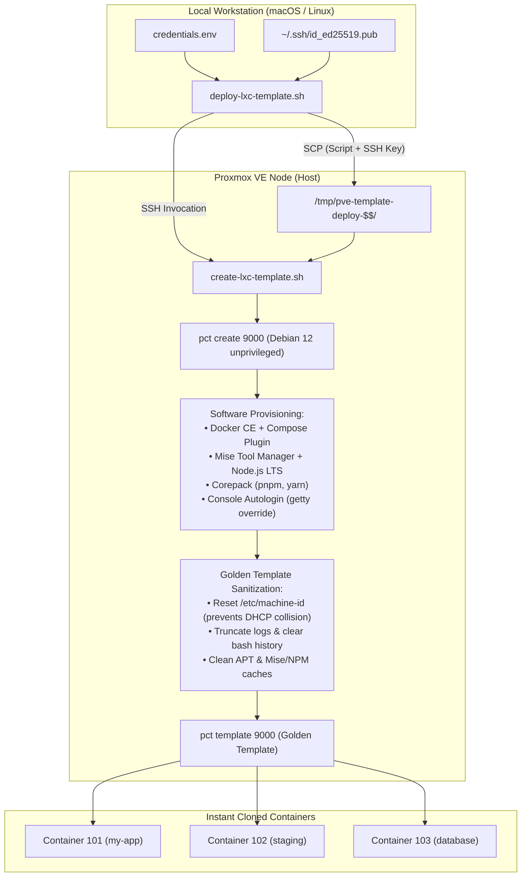

# Proxmox VE - Debian 12 LXC Golden Template

[](https://www.proxmox.com/)
[-red.svg?logo=debian&logoColor=white)](https://www.debian.org/)
[](https://www.docker.com/)
[](https://mise.jdx.dev/)
[](https://nodejs.org/)
[](LICENSE)

An enterprise-grade automation toolkit to build and maintain **Debian 12 (Bookworm) LXC Golden Templates** on Proxmox VE. Pre-bundled with **Docker CE, Docker Compose, Mise Tool Manager, Node.js LTS, and Corepack (pnpm & yarn)**, fully hardened and sanitized for instantaneous homelab and production container provisioning.

---

## Architecture & Deployment Workflow



---

## Key Features

- **Standard Hardware Profile**:
  - **Template ID**: `9000` (Hostname: `lxc-debian`).
  - **Resources**: 2 vCPUs, 2048 MB RAM, 1024 MB Swap, 15 GB SSD rootfs (allocated on `local-lvm` or chosen storage).
  - **Networking**: DHCP on bridge `vmbr0` with Proxmox firewall enabled.
- **Production-Ready Docker Stack**:
  - Official Docker CE repository integration (`docker-ce`, `docker-ce-cli`, `containerd.io`).
  - Docker Compose Plugin (`docker compose`) and Buildx Plugin.
  - Enabled and managed by `systemd` (`systemctl enable docker`).
- **Developer Toolchain & Node.js (Managed by Mise)**:
  - Official APT repository installation of **Mise** (`/usr/bin/mise`).
  - **Node.js LTS** pre-installed and configured as global default (`mise use -g node@lts`).
  - **Corepack** pre-enabled with pre-fetched binaries for both **pnpm** and **yarn** alongside **npm**.
  - Complete environment PATH wiring (`/etc/environment`, `/etc/profile.d/mise.sh`, `/root/.bashrc`, and symlinks in `/usr/bin` and `/usr/local/bin`) ensuring immediate CLI availability across SSH, GUI Console, and non-interactive `pct exec` sessions.
  - Essential baseline utilities: `git`, `curl`, `wget`, `sudo`, `ca-certificates`, `gnupg`, `lsb-release`.
- **Hardened Unprivileged Security**:
  - Unprivileged container (`unprivileged=1`).
  - Pre-configured features: **`nesting=1,keyctl=1`** (Proxmox-recommended standard for secure in-container Docker).
- **Console Autologin**:
  - Automatically logs into the `root` account when opening the Proxmox Web GUI Console (`xterm.js` / `noVNC`) without password prompts.
- **Golden Template Sanitization**:
  - Truncates `/etc/machine-id` and `/var/lib/dbus/machine-id` so each clone receives a unique DHCP IP.
  - Purges Mise, NPM, and APT caches, temporary files, system log files, and shell history.
- **Zero-Touch Authentication**:
  - Injects your workstation's SSH public key (`~/.ssh/id_ed25519.pub`) into `/root/.ssh/authorized_keys` for instant passwordless SSH access.

---

## Repository Structure

```text
lab-proxmox/
├── credentials.env               # Cluster host IP, storage, bridge settings (git-ignored)
├── credentials.env.example       # Template configuration file
├── LICENSE                       # MIT License
├── README.md                     # Project documentation
└── scripts/
    ├── create-lxc-template.sh    # Proxmox VE native provisioning script
    └── deploy-lxc-template.sh    # Local workstation one-click deployment script
```

---

## Prerequisites

1. **Proxmox VE 8.x+** node accessible over SSH with root privileges.
2. **Local Machine (macOS / Linux)** with `ssh` and `scp`.
3. **SSH Key Pair**: `~/.ssh/id_ed25519.pub` (or `id_rsa.pub`).

---

## Quick Start

### 1. Configure Connection Settings

Copy the sample environment file and adjust your Proxmox server IP:

```bash
cp credentials.env.example credentials.env
```

Edit `credentials.env`:

```bash
# Proxmox VE Server URL
PVE_HOST="https://192.168.250.4:8006"
PVE_NODE="pve"
PVE_STORAGE="local-lvm"
PVE_BRIDGE="vmbr0"
```

### 2. Deploy Golden Template (One Command)

Run the deployment script from your local workstation:

```bash
cd /path/to/lab-proxmox

# Deploy Golden Template (ID 9000, hostname: lxc-debian):
./scripts/deploy-lxc-template.sh --force
```

The script will automatically:
1. Parse host IP and storage from `credentials.env`.
2. Discover your local SSH public key.
3. Upload provisioning assets to a secure temporary directory on Proxmox.
4. Execute `create-lxc-template.sh`, verify prerequisites, configure software, sanitize, and convert to template.
5. Clean up temporary files on completion.

---

## CLI Options & Customization

Both scripts provide flexible CLI arguments to tailor resources, software stacks, and container IDs.

### Workstation Script: `deploy-lxc-template.sh`

| Option | Description | Default |
| :--- | :--- | :--- |
| `-h, --host <IP\|HOST>` | Proxmox VE IP address / hostname | From `credentials.env` |
| `-u, --user <USER>` | SSH user for Proxmox VE | `root` |
| `-p, --port <PORT>` | SSH port for Proxmox VE | `22` |
| `-i, --id <ID>` | Container ID for the template | `9000` |
| `-n, --hostname <NAME>` | Hostname of the template | `lxc-debian` |
| `-c, --cores <NUM>` | Number of vCPU cores | `2` |
| `-m, --memory <MB>` | RAM size in MB | `2048` |
| `-d, --disk <GB>` | Rootfs disk size in GB | `15` |
| `-s, --storage <STORAGE>`| Target storage pool for rootfs | `local-lvm` |
| `-b, --bridge <BRIDGE>` | Network bridge | `vmbr0` |
| `-k, --ssh-key <PATH>` | Local SSH public key path | `~/.ssh/id_ed25519.pub` |
| `--node-version <VER>` | Node.js version installed via Mise | `lts` |
| `--no-docker` | Skip Docker CE installation | `Enabled` |
| `--no-mise` | Skip Mise & Node.js installation | `Enabled` |
| `-f, --force` | Overwrite / destroy existing container ID | `Disabled` |
| `--help` | Show help message | |

#### Deployment Examples

```bash
# Provision with a specific Node.js version (e.g. Node 22):
./scripts/deploy-lxc-template.sh --force --node-version 22

# Minimal template with Node.js/Mise only (no Docker):
./scripts/deploy-lxc-template.sh --force --no-docker

# High-resource template:
./scripts/deploy-lxc-template.sh --force -i 9100 --cores 4 --memory 4096 --disk 30
```

---

### Host Script: `create-lxc-template.sh`

If you are already connected to your Proxmox host via SSH:

```bash
chmod +x scripts/create-lxc-template.sh

# Run directly on Proxmox node:
./scripts/create-lxc-template.sh --force -k /root/.ssh/authorized_keys
```

| Option | Description | Default |
| :--- | :--- | :--- |
| `-i, --id <ID>` | Container ID | `9000` |
| `-s, --storage <NAME>` | Target storage pool for rootfs | `local-lvm` |
| `-t, --template <FILE>` | Base OS appliance file | `debian-12-standard_12.12-1_amd64.tar.zst` |
| `--tmpl-storage <NAME>` | Template storage pool | `local` |
| `-k, --ssh-key <PATH>` | Public SSH key to inject | Host `/root/.ssh/authorized_keys` |
| `-b, --bridge <NAME>` | Network bridge | `vmbr0` |
| `-c, --cores <NUM>` | Number of CPU cores | `2` |
| `-m, --memory <MB>` | RAM size in MB | `2048` |
| `--swap <MB>` | Swap size in MB | `1024` |
| `-d, --disk <GB>` | Rootfs disk size in GB | `15` |
| `-n, --hostname <NAME>`| Container hostname | `lxc-debian` |
| `--node-version <VER>` | Node.js version | `lts` |
| `--no-docker` | Skip Docker CE installation | `Enabled` |
| `--no-mise` | Skip Mise & Node.js installation | `Enabled` |
| `-f, --force` | Overwrite existing ID | `Disabled` |

---

## Cloning & Using Containers

Once the template is created (`ID 9000` / `lxc-debian`), you can instantiate new containers in seconds.

### Option A: Proxmox CLI

```bash
# 1. Full-clone a new container (ID: 101, hostname: 'web-service')
pct clone 9000 101 --hostname web-service --full 1

# 2. Start the container
pct start 101

# 3. Verify Docker runtime inside container
pct exec 101 -- docker --version
pct exec 101 -- docker compose version
pct exec 101 -- docker run --rm hello-world

# 4. Verify Node.js toolchain inside container
pct exec 101 -- node -v
pct exec 101 -- npm -v
pct exec 101 -- pnpm -v
pct exec 101 -- yarn -v
pct exec 101 -- mise --version
```

### Option B: Proxmox Web GUI

1. Open Proxmox Web GUI (`https://<PROXMOX_IP>:8006`).
2. In the resource tree, right-click **9000 (lxc-debian)** $\rightarrow$ Select **Clone**.
3. Set your new **VMID** (e.g. `101`) and **Hostname**.
4. Set Mode to **Full Clone**.
5. Click **Clone** and start your new container.

### Option C: Direct Passwordless SSH

Since your workstation's SSH key was baked into the template:

```bash
# Connect directly to the newly cloned container:
ssh root@<CONTAINER_IP>

# Inside the container:
docker ps
node -v
pnpm -v
```

---

## Golden Template Sanitization Details

To guarantee production readiness and prevent cross-container state leakage, `create-lxc-template.sh` performs automated sanitization before converting to a template:

1. **Unique Machine ID (`/etc/machine-id`)**:
   Truncated so that `systemd-networkd` / ISC DHCP client requests a unique IP address for each newly cloned container rather than sharing the template's DHCP lease.
2. **Caches & Artifacts Purge**:
   - Mise download cache: `/root/.cache/mise`
   - NPM cache: `/root/.npm/_cacache`
   - APT cache: `/var/lib/apt/lists/*` and `apt-get clean`
   - Temporary directories: `/tmp/*`, `/var/tmp/*`
3. **Audit & Log Truncation**:
   - Zeroes all log files under `/var/log/**/*.log`
   - Clears shell history (`/root/.bash_history` and `history -c`)

---

## Troubleshooting & FAQ

### Container fails to get Internet access during creation
- Ensure Proxmox bridge (`vmbr0`) is properly bound to an interface with active gateway/DHCP routing.
- If your environment does not use DHCP on `vmbr0`, ensure IP forwarding and NAT rules are enabled on the Proxmox host.

### Docker fails with overlay2 / permission issues in LXC
- Unprivileged LXC containers running Docker require `nesting=1` and `keyctl=1`. These are configured automatically by `create-lxc-template.sh`.
- Check `/etc/pve/lxc/<ID>.conf` to ensure `features: nesting=1,keyctl=1` is present.

### Storage pool errors (`storage does not exist`)
- Run `pvesm status` on your Proxmox node to view available storage pools.
- If using ZFS or Ceph instead of LVM-Thin, pass `-s <pool_name>` (e.g., `-s local-zfs`).

---

## License

This project is licensed under the terms of the [MIT License](LICENSE).
